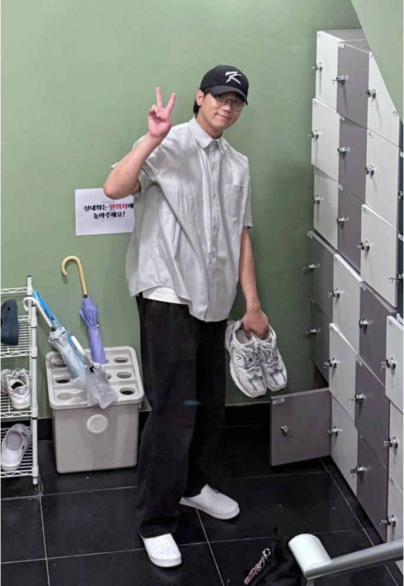

# 심교남: 게임 프로그래머

| 심교남(Kyonam Shim) |  |
| :--------------: | --------------------------- |
| Birthday         | 2002.02.13                  |
| Email            | tlaryska12@naver.com        |
| Current Address  | 대구광역시 달서구                |
| Work Area        | 대구광역시, 서울특별시, 경기 전 지역 |

## 보유기술 / Skill

| 구분                  | Skill                      |
| -------------------- | -------------------------- |
| Programing Languages | C#, C++, Java, Python      |
| Game Engine          | Unity, Unreal              |
| DevOps               | CI(Jenkins), SCM(Git, SVN) |

## 자기소개서 / About Me
### [도전과 성장을 멈추지 않는 클라이언트 개발자, 심교남입니다]
초등학교 시절부터 게임 개발에 관심이 많아 파워포인트나 게임메이커로 게임을 만들기 시작했고, 고등학교 시절부터 C언어와 콘솔 게임 개발로 기본기를 다졌으며, 특성화고 졸업 후 곧바로 실무에 뛰어들어 3년간 유니티 엔진 기반의 상용 게임 개발을 경험했습니다. 실무와 이론의 균형을 맞추기 위해 방통대 컴퓨터과학과를 병행하여 학위를 취득했고, 현업 경험 이후에도 멈추지 않고 개인 프로젝트를 하며 클라이언트 개발자로서의 전문성을 다듬고 있습니다. 단순한 기능 구현을 넘어, 효율적인 아키텍처 설계와 팀의 생산성을 높이는 개발자가 되는 것이 저의 목표입니다.

### [핵심 역량: 라이브 서비스 경험과 효율적인 파이프라인 구축]
- 성공적인 라이브 서비스 경험: 2020년 말 출시된 수집형 비주얼 노벨 게임의 클라이언트 파트를 담당하여, 1년 반 이상 안정적인 라이브 서비스를 이끌었습니다. 신규 콘텐츠(이벤트, 시스템)의 빠른 업데이트 주기를 맞추기 위해 클라이언트 구조를 모듈화하고 최적화하는 데 기여했습니다.
- 개발 환경 최적화 및 도구 제작: 단순히 주어진 기획을 구현하는 것을 넘어, 기획자와 아트 직군이 효율적으로 작업할 수 있도록 유니티 에디터 툴을 확장하고 빌드 파이프라인을 개선한 경험이 있습니다.
- 신규 프로젝트(Project-H) 기반 제작: 기존 라이브 서비스의 경험을 바탕으로, 신규 프로젝트의 초기 클라이언트 아키텍처 설계에 참여하여 프로젝트의 안정적인 출발을 견인했습니다.

### [제 성격]
저는 기술적 호기심이 강하며, 새로운 엔진 기능이나 아키텍처를 도입하여 기존의 문제점을 해결하는 과정을 즐깁니다. 현업에서 발생하는 성능 병목 현상이나 구조적 한계를 마주했을 때, 주먹구구식 해결보다는 근본적인 원인을 찾고 개선하려 노력합니다.
최근에는 3년간의 실무 경험과, 대학 진학을 통해 알고리즘과 자료구조 등 컴퓨터 과학(CS) 기본기를 더욱 탄탄히 다졌습니다. 단순한 기능 구현을 넘어 성능과 확장성을 보장하는 코드 구조를 설계 해 업무 효율 향상에 도움을 드릴 수 있습니다. 또한, 저는 제가 작성한 코드와 구조를 주변 개발자들과 공유하고 코드 리뷰를 주고받으며 함께 성장하는 문화를 지향합니다.

### [제 강점]
저의 가장 큰 강점은 팀의 빈 곳을 찾아 메우는 솔선수범의 자세입니다.
프로젝트를 진행하다 보면 명확히 담당자가 정해지지 않은 R&D 이슈나 번거로운 유지보수 작업이 발생하기 마련입니다. 저는 이러한 업무들을 선뜻 맡아 처리하며 팀의 전체적인 진행 속도를 높이는 데 기여해 왔습니다.
과거에는 책임감이 강해 혼자서 업무를 끌어안으려는 경향이 있었으나, 실무 경험을 통해 협업의 중요성을 깨달았습니다. 이제는 막히는 부분이 있을 때 적극적으로 이슈를 공유하고 동료들과 피드백을 주고받으며, 팀 단위의 효율적인 문제 해결을 추구하고 있습니다.

## 이력 / Experience

경력: 2020.01 ~ 2022.08 : 2년 8개월

| 재직 기간         | 회사명              | 부서 및 R&R             | 비고                    |
| ----------------- | ------------------- | ----------------------- | ----------------------- |
| 2020.01 ~ 2022.08 | (주) 비비드스튜디오 | 게임개발본부 게임개발실 |                         |
| 2022.06 ~         | (주) 엔씨엘오       | 게임개발본부 게임개발실 | 합병으로 인한 사명 변경 |

학력 사항

| 재학 기간         | 학교명                 | 학과             | 비고   |
| ----------------- | ---------------------- | ---------------- | ------ |
| 2017.03 ~ 2020.01 | 한국애니메이션고등학교 | 컴퓨터게임제작과 | 졸업 |
| 2020.03 ~ 2022.02 | 한국방송통신대학교     | 컴퓨터과학과(학사) | 입학 |
| 2024.03 ~ 2026.02 | 국립부경대학교        | 컴퓨터공학전공(학사) | 졸업예정(편입) |

## 주요 프로젝트 및 경험 : 비비드 스튜디오 (계열) : 2020.01 ~ 2022.08

- TCG RPG 전문 게임 개발사
- 개발팀 구성 : 전체 30명 규모 / 엔지니어 9명 / 클라이언트 5명
- 참여 프로젝트 : 풀스택 모바일 게임
    - 썸머코드 : 내가 모르는 어제 (라이브)
    - Project H 
    - Project A
- 소속 : 게임개발본부 게임기술실

## 주요 경험

- Unity Engine을 사용한 2D 게임 개발
- 효율적인 작업을 위한 Unity Editor Tool 개발
- 스파인을 활용한 캐릭터 커스터마이징 기능 구현
- Addressable 에셋 로딩 시스템에 대한 이해
- 유니티 프로파일러를 활용한 최적화 작업
- 서브버전을 통한 개발환경 구성 및 관리
- XCode를 통한 iOS 빌드 대응
- Jenkins를 통한 원격 AOS / iOS 빌드 환경 구성
- AOS/iOS 빌드 이슈 대응
- 라이브 운영 중 이슈 대응과 컨텐츠 추가 작업

### 효율적인 작업을 위한 Unity Editor Tool 개발

효율적인 작업을 위해 씬 이동 기능과 스테이지 진행 매크로, 데이터 강제 갱신등의 기능을 담은 Editor Tool을 작업하여 배포했습니다.

### Addressable 에셋 로딩 시스템에 대한 이해

현재 라이브 중인 썸머코드에서는 에셋 번들을 활용하고 있었습니다.
클라이언트 리드엔지니어님께서 관리의 용이함을 위해 새 프로젝트는 Addressable 시스템으로 옮기는 작업을 해주셨고, 
이에 따른 코드 시안, 개선 및 오류 수정을 했습니다.

### 스파인을 활용한 캐릭터 커스터마이징 기능 구현

라이브 2D 스파인을 통해 캐릭터의 헤어스타일, 헤어 색상, 표정, 액세서리 장착 등의 기능을 구현했습니다.

### 유니티 프로파일러를 활용한 최적화 작업
현재 라이브중인 썸머코드를 폴리싱 하던 과정에서 원인을 알수 없는 프레임 드랍 현상이 있었습니다.
이때 Profiler를 활용해 원인이 되는 코드를 파악하고 해소하는 경험을 했었습니다.
또한, 메모리가 적은 저사양 기기에서 크래시가 일어나는 현상이 있었고,
Memory Profiler를 통해 메모리가 과도하게 사용되는 부분과 누수 현상을 발견했습니다.
이를 정리한 뒤 리드엔지니어님께 전달해 드려 원인을 해결했던 경험이 있었습니다.

### 서브버전을 통한 개발환경 구성 및 관리
SVN을 통해 효율적인 개발환경 구성을 했습니다.
또한, 브랜치를 직접 진행해보며 버전별로 프로젝트를 관리할 수 있게 구성했습니다.

### XCode를 통한 iOS 빌드 이슈 대응
새 Mac 장비에 iOS 빌드 환경을 구성하면서 유니티 빌드 이후 XCode 빌드 환경설정을 맡은 적이 있습니다.
CocoaPod이나 인증서 오류 등의 이슈를 겪었고, 리드엔지니어님에게 도움을 받아 가며 해소한 경험이 있습니다.

### Jenkins를 통한 원격 AOS / iOS 빌드 환경 구성
Jenkins를 통해 원격 빌드 및 자동화가 가능하도록 환경을 구성했습니다.
커맨드나 셸스크립트를 통해 프로젝트 세팅을 복사하는 기능과,
번들 빌드는 아마존 AWS에 올라갈 수 있도록 주소를 맞춰주는 작업 등을 진행했습니다.
또한 종종 발생하는 빌드 이슈 (환경 설정 실수, 단순 충돌 오류 등)에 대응했습니다.

### 라이브 운영 중 이슈 대응과 컨텐츠 추가 작업
썸머코드를 출시하며 라이브 운영 도중 미처 발견하지 못했던 이슈를 겪어봤고,
긴급하게 발생한 서버 이슈에 원인 파악과 QA를 도와드리는 경험을 했었습니다.

## 참여 프로젝트 및 기여
입사 후, 썸머코드의 클라이언트 개발 작업을 진행했습니다.
인게임과 비주얼노벨식 스토리 재생 기능 작업, 그리고 컨텐츠 개발 등을 작업했습니다.
썸머코드의 라이브 시작 이후, 라이브 이슈 대응과, 추가 컨텐츠 개발을 진행했습니다.
이후 Project H에서도 컨텐츠 개발, 어드레서블 기능 작업 등을 진행했습니다.
게임 외적인 부분에서도 오류 로그 처리, 빌드 시 예외 처리, 코드 정리 등을 진행하며 프로젝트에 기여한 바 있습니다.
공통 기술을 기반으로 개발하는 것이 컨셉이기 때문에, 라이브, 신작과 관계없이 개발에 참여했습니다.
이를 통해 적은 인력으로도 유연하게 대응할 수 있도록 엔지니어 전체가 모든 프로젝트에 참여하여 성과를 내었습니다.

- 사용언어 및 개발 환경: C#, Unity, Jenkins, Git, SVN, Redmine

### 썸머코드 : 내가 모르는 어제 (2020.01 ~ )

- 컨텐츠 개발
    - 독서 (쿠킹)
    - 근무일지 (쿠킹)
    - 업적 시스템
    - 친구
    - 우편
    - 이벤트
        - 기간 출석 이벤트
        - 시간 출석 이벤트
        - 계절별 이벤트 (전투를 통해 모은 이벤트 재화 소모)
    - 카드 소환 (가챠)
    - 내 카드
    - 내 가방
    - 진행도 별 컨텐츠 잠금/오픈
        - 최상위 씬의 오브젝트 중, 컨텐츠의 태그가 달린 것들을 수정해 
    - 컨텐츠 튜토리얼
    - 러브시그널 (PVP)
    - BM 이벤트
        - 누적 충전
        - 다이아 첫 충전
    - 수사 (인게임)
        - 선택지를 통한 점수 획득 및 카드 선택으로 점수 비
    - 컨텐츠 네비게이션
- 환경 개발
    - 에셋 번들을 통한 에셋 로딩 및 패치
    - 다국어 작업
    - 젠킨스 및 원격 빌드 환경 구성
    - 서브버전을 통한 브랜치 분리로 프로젝트 관리

### Project H : 2021.03 ~

- 컨텐츠 개발
    - 썸머코드 기능 마이그레이션
        - 미션
        - 업적
        - 친구
    - 시간 단위 누적 보상
    - 진행도 별 컨텐츠 잠금/오픈
    - 컨텐츠 튜토리얼 기능
    - 캐릭터 커스터마이징
        - 캐릭터 스파인을 통한 헤어, 표정, 액세서리 장착 기능
    - 전투 (인게임)
    - 퀘스트 트래커 (퀘스트 알림 및 네비게이션)
    - 무도회 (PVP)
- 환경 개발
    - Addressable 비동기 에셋 로딩 개선 작업
    - 씬 모듈화 작업
    - 유니티 에디터를 통한 개발용 매크로 및 기능 제작
    - 다국어 작업
    - 젠킨스 및 원격 빌드 환경 구성
    - 서브버전을 통한 브랜치 분리로 프로젝트 관리
