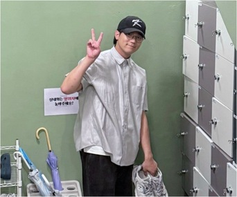

# 심교남: 게임 프로그래머

| 심교남(Kyonam Shim) |  |
| :--------------: | --------------------------- |
| Birthday         | 2002.02.13                  |
| Email            | tlaryska12@naver.com        |
| Current Address  | 대구광역시 달서구                |
| Work Area        | 대구광역시, 서울특별시, 경기 전 지역 |

## 보유기술 / Skill

| 구분                  | Skill                      |
| -------------------- | -------------------------- |
| Programing Languages | C#, C++                    |
| Game Engine          | Unity, Unreal              |
| DevOps               | CI(Jenkins), SCM(Git, SVN) |

## 자기소개서 / About Me
멋진 게임 개발자가 되기 위해 계속 달려가고 있습니다.
현업에서 게임 개발을 하며, 고퀄리티의 게임을 개발하는 프로그래머가 되는것이 제 꿈입니다.
초등학생때부터도 게임메이커나 파워포인트로 간단한 게임을 만들었고,
고등학교 부터 게임 개발 관련 학과가 있는 특성화고로 진학하여, 제대로 된 게임을 개발하기 시작했습니다.
졸업 이후 현업에서 게임을 개발하면서 많은 경험을 쌓았고.
현업에서 일하면서도 전문적 프로그래밍 지식을 배우고자 하여 고등학교 졸업과 동시에 한국방송통신대학교의 컴퓨터과학과에 입학했습니다.
현재, 저는 국립부경대학교에 편입하여 프로그래밍의 기본기를 연마하고 있습니다.
지식을 제대로 갖춘 개발자가 되어, 대한민국 게임업계의 별이 되고 싶습니다.

### [제가 할 수 있는 것]
2020년 말에 출시하여 2년이 넘게 서비스 된 수집형 비주얼 노벨류 게임의 유니티 엔진을 통한 개발, 효율적인 개발을 위한 환경 구성과 유지보수 그리고 신규 콘텐츠 개발 등의 업무를 담당했습니다.
현재까지의 회사 생활을 통해 현업에서의 효율적인 개발 방식을 이해하고 적용하게 되었습니다.
무엇보다도 그저 코드만 열심히 짜면 되는줄 알았던 편협했던 생각에서 벗어나게 되어, 협업을 통해 팀으로 개발하는 방법을 배우게 되었습니다.
그 어떤 업무 진행 방식이라도 빠르게 적응하여 프로젝트가 계획적으로 진행되는데 큰 도움을 드릴 수 있습니다.
저의 실무 프로그래밍 경험과 협업을 좋아하는 성격 그리고 열정으로 어느 회사에서든 저의 능력을 쏟아부을 것입니다.

### [제가 하고 싶은 것]
저는 아직 철이 없습니다.
현재 국내에서 출시되는 게임들은 대기업이 아닌 이상 디테일, 마감의 퀄리티가 떨어지는 형국이 강하다고 생각합니다.
같은 스펙의 게임이어도 해외에서 출시되는 게임에 비해 최적화 정도가 떨어지는 경우도 허다합니다.
그래서 아직까지도 "국산 게임이 이렇게 퀄리티 있고, 최적화가 잘 되어서 나올 수 있구나."라는 감탄이 나올 만한 게임을 만드는게 제 꿈입니다.
그러기 위해 상용 엔진쪽 지식과 노하우, 또한 이를 넘어선 게임 엔진 분야의 코어한 지식에 갈망이 강합니다.
단순히 돈을 많이 받고, 안분지족의 삶을 사는것은 원하지 않습니다.
모르면 공부하고, 익히지 않은건 연습하며, 없는 것을 연구해나가면서 성장해 나가는 것.
이 당연하지만 어려운 일을, 진득하게 앉아서 열심히 해나갈 둥지를 찾고 싶습니다.

### [제가 생각하는 장점]
저의 장점은 솔선수범의 태도입니다. 비교적 남들이 꺼리고, 남들이 선뜻 나서지 못하는 일을 제가 먼저 나서서 하려 한다는 것이 저의 가장 큰 장점이라고 생각합니다.

### [제가 생각하는 단점]
남의 눈치를 보면서 힘든 티를 내지 않는 것이 저의 단점이라고 생각합니다. 비록 저의 일감은 제가 해야 한다는 강박 관념이 있지만, 협업하며 일하는 방법을 배워 단점을 보완해가고 있습니다.

### [제가 좋아하는 것]
저는 운동신경이 좋아서 스포츠 활동을 하는 것을 좋아합니다.
또한 저를 이 길로 이끌어준 게임을 즐기는 것을 당연히 사랑합니다.
무엇보다도 다른 사람과 대화하거나 만나는 것을 가장 좋아합니다.
이야기를 나누며 그 사람에 대해 알아가고 같이 일하거나 놀면서 친해지는 데서 즐거움을 느끼기 때문입니다.
많은 선배님을 만나고 많은 교류를 하는 것이 제 희망 사항입니다.

## 이력 / Experience

경력: 2020.01 ~ 2022.08 : 2년 8개월

| 재직 기간         | 회사명              | 부서 및 R&R             | 비고                    |
| ----------------- | ------------------- | ----------------------- | ----------------------- |
| 2020.01 ~ 2022.08 | (주) 비비드스튜디오 | 게임개발본부 게임개발실 |                         |
| 2022.06 ~         | (주) 엔씨엘오       | 게임개발본부 게임개발실 | 합병으로 인한 사명 변경 |

학력 사항

| 재학 기간         | 학교명                 | 학과             | 비고   |
| ----------------- | ---------------------- | ---------------- | ------ |
| 2017.03 ~ 2020.01 | 한국애니메이션고등학교 | 컴퓨터게임제작과 | 졸업 |
| 2020.03 ~ 2022.02 | 한국방송통신대학교     | 컴퓨터과학과(학사) | 입학 |
| 2024.03 ~ 2026.02 | 국립부경대학교        | 컴퓨터공학전공(학사) | 졸업예정(편입) |

## 주요 프로젝트 및 경험 : 비비드 스튜디오 (계열) : 2020.01 ~ 2022.08

- TCG RPG 전문 게임 개발사
- 개발팀 구성 : 전체 30명 규모 / 엔지니어 9명 / 클라이언트 5명
- 참여 프로젝트 : 풀스택 모바일 게임
    - 썸머코드 : 내가 모르는 어제 (라이브)
    - Project H 
    - Project A
- 소속 : 게임개발본부 게임기술실

## 주요 경험

- Unity Engine을 사용한 2D 게임 개발
- 효율적인 작업을 위한 Unity Editor Tool 개발
- 스파인을 활용한 캐릭터 커스터마이징 기능 구현
- Addressable 에셋 로딩 시스템에 대한 이해
- 유니티 프로파일러를 활용한 최적화 작업
- 서브버전을 통한 개발환경 구성 및 관리
- XCode를 통한 iOS 빌드 대응
- Jenkins를 통한 원격 AOS / iOS 빌드 환경 구성
- AOS/iOS 빌드 이슈 대응
- 라이브 운영 중 이슈 대응과 컨텐츠 추가 작업

### 효율적인 작업을 위한 Unity Editor Tool 개발

효율적인 작업을 위해 씬 이동 기능과 스테이지 진행 매크로, 데이터 강제 갱신등의 기능을 담은 Editor Tool을 작업하여 배포했습니다.

### Addressable 에셋 로딩 시스템에 대한 이해

현재 라이브 중인 썸머코드에서는 에셋 번들을 활용하고 있었습니다.
클라이언트 리드엔지니어님께서 관리의 용이함을 위해 새 프로젝트는 Addressable 시스템으로 옮기는 작업을 해주셨고, 
이에 따른 코드 시안, 개선 및 오류 수정을 했습니다.

### 스파인을 활용한 캐릭터 커스터마이징 기능 구현

라이브 2D 스파인을 통해 캐릭터의 헤어스타일, 헤어 색상, 표정, 액세서리 장착 등의 기능을 구현했습니다.

### 유니티 프로파일러를 활용한 최적화 작업
현재 라이브중인 썸머코드를 폴리싱 하던 과정에서 원인을 알수 없는 프레임 드랍 현상이 있었습니다.
이때 Profiler를 활용해 원인이 되는 코드를 파악하고 해소하는 경험을 했었습니다.
또한, 메모리가 적은 저사양 기기에서 크래시가 일어나는 현상이 있었고,
Memory Profiler를 통해 메모리가 과도하게 사용되는 부분과 누수 현상을 발견했습니다.
이를 정리한 뒤 리드엔지니어님께 전달해 드려 원인을 해결했던 경험이 있었습니다.

### 서브버전을 통한 개발환경 구성 및 관리
SVN을 통해 효율적인 개발환경 구성을 했습니다.
또한, 브랜치를 직접 진행해보며 버전별로 프로젝트를 관리할 수 있게 구성했습니다.

### XCode를 통한 iOS 빌드 이슈 대응
새 Mac 장비에 iOS 빌드 환경을 구성하면서 유니티 빌드 이후 XCode 빌드 환경설정을 맡은 적이 있습니다.
CocoaPod이나 인증서 오류 등의 이슈를 겪었고, 리드엔지니어님에게 도움을 받아 가며 해소한 경험이 있습니다.

### Jenkins를 통한 원격 AOS / iOS 빌드 환경 구성
Jenkins를 통해 원격 빌드 및 자동화가 가능하도록 환경을 구성했습니다.
커맨드나 셸스크립트를 통해 프로젝트 세팅을 복사하는 기능과,
번들 빌드는 아마존 AWS에 올라갈 수 있도록 주소를 맞춰주는 작업 등을 진행했습니다.
또한 종종 발생하는 빌드 이슈 (환경 설정 실수, 단순 충돌 오류 등)에 대응했습니다.

### 라이브 운영 중 이슈 대응과 컨텐츠 추가 작업
썸머코드를 출시하며 라이브 운영 도중 미처 발견하지 못했던 이슈를 겪어봤고,
긴급하게 발생한 서버 이슈에 원인 파악과 QA를 도와드리는 경험을 했었습니다.

## 참여 프로젝트 및 기여
입사 후, 썸머코드의 클라이언트 개발 작업을 진행했습니다.
인게임과 비주얼노벨식 스토리 재생 기능 작업, 그리고 컨텐츠 개발 등을 작업했습니다.
썸머코드의 라이브 시작 이후, 라이브 이슈 대응과, 추가 컨텐츠 개발을 진행했습니다.
이후 Project H에서도 컨텐츠 개발, 어드레서블 기능 작업 등을 진행하고 있습니다.
게임 외적인 부분에서도 오류 로그 처리, 빌드 시 예외 처리, 코드 정리 등을 진행하며 프로젝트에 기여한 바 있습니다.
공통 기술을 기반으로 개발하는 것이 컨셉이기 때문에, 라이브, 신작과 관계없이 개발에 참여하고 있습니다.
이를 통해 적은 인력으로도 유연하게 대응할 수 있도록 엔지니어 전체가 모든 프로젝트에 참여하고 있습니다.

- 사용언어 및 개발 환경: C#, Unity, Jenkins, Git, SVN, Redmine

### 썸머코드 : 내가 모르는 어제 (2020.01 ~ )

- 컨텐츠 개발
    - 독서 (쿠킹)
    - 근무일지 (쿠킹)
    - 업적 시스템
    - 친구
    - 우편
    - 이벤트
        - 기간 출석 이벤트
        - 시간 출석 이벤트
        - 계절별 이벤트 (전투를 통해 모은 이벤트 재화 소모)
    - 카드 소환 (가챠)
    - 내 카드
    - 내 가방
    - 진행도 별 컨텐츠 잠금/오픈
        - 최상위 씬의 오브젝트 중, 컨텐츠의 태그가 달린 것들을 수정해 
    - 컨텐츠 튜토리얼
    - 러브시그널 (PVP)
    - BM 이벤트
        - 누적 충전
        - 다이아 첫 충전
    - 수사 (인게임)
        - 선택지를 통한 점수 획득 및 카드 선택으로 점수 비
    - 컨텐츠 네비게이션
- 환경 개발
    - 에셋 번들을 통한 에셋 로딩 및 패치
    - 다국어 작업
    - 젠킨스 및 원격 빌드 환경 구성
    - 서브버전을 통한 브랜치 분리로 프로젝트 관리

### Project H : 2021.03 ~

- 컨텐츠 개발
    - 썸머코드 기능 마이그레이션
        - 미션
        - 업적
        - 친구
    - 시간 단위 누적 보상
    - 진행도 별 컨텐츠 잠금/오픈
    - 컨텐츠 튜토리얼 기능
    - 캐릭터 커스터마이징
        - 캐릭터 스파인을 통한 헤어, 표정, 액세서리 장착 기능
    - 전투 (인게임)
    - 퀘스트 트래커 (퀘스트 알림 및 네비게이션)
    - 무도회 (PVP)
- 환경 개발
    - Addressable 비동기 에셋 로딩 개선 작업
    - 씬 모듈화 작업
    - 유니티 에디터를 통한 개발용 매크로 및 기능 제작
    - 다국어 작업
    - 젠킨스 및 원격 빌드 환경 구성
    - 서브버전을 통한 브랜치 분리로 프로젝트 관리
